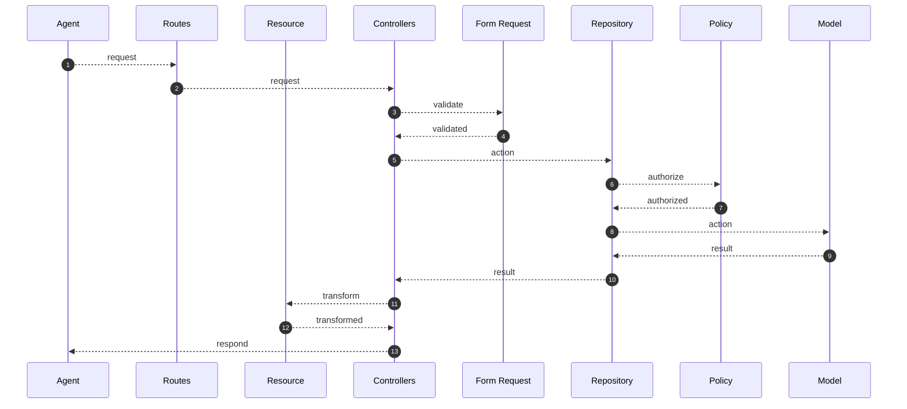

# Tagd Retailers API

| Env   | Url   |
| ----- | ----- |
| Dev   | http://localhost:9113 |

## What it does

This [Laravel](https://laravel.com) project provides an API for affiliates to interact with Tagd API

### Changelog

Please see [CHANGELOG](CHANGELOG.md) for more information what has changed recently.

## Getting Started

To get a local copy up and running follow these simple example steps.

### Installation

1. Prepare `docker/docker-compose.override.yml` if you plan to work with local packages

2. Start the containers with the `docker/restart_dev_containers.sh` script

3. The script should have created a valid `.env` file. Feel free to edit any setting, i.e. database connection.

> Should you need to recreate the `.env` file just delete it and run the script again.

4. The script should also have created a valid `auth.json` file, which grants you access to the package registry.

If you need to create it manually, you can follow this steps:

```
cp auth.json.example auth.json
read_token=$(vault read -field=read_token secret/dev/tagd/packages)
sed -i "s/<read_token>/${read_token}/g" auth.json
```

5. Make sure your packages are up to date

```
composer install
```

6. Publish the Tagd/Core configuration file (optional)

```
php artisan vendor:publish --provider="Tagd\Core\Providers\TagdServiceProvider"
```

Then edit the `/config/tagd.php` in your project.

7. The Tagd/Core package requires a few [migrations](database/migrations) and [seeds](database/seeds).
Run the artisan commands if needed:

```
php artisan migrate
php artisan tagd:seed:dev
```

## Usage

Use this space to show useful examples of how a project can be used. Additional screenshots, code examples and demos work well in this space. You may also link to more resources.

### Versioning

There is an API middleware at [app/Http/Middleware/ApiVersion.php](app/Http/Middleware/ApiVersion.php)

> Currently latest API version is 1 If you add a new version remember to update the `api_latest` setting at [config/app.php](config/app.php)

### Routes

Routes are definat at [routes/api_v1.php](routes/api_v1.php) and you can see there is one set of routes for each API version.

The most common routes are to access CRUD operations on resources, you can define new routes easily with:

```php
Route::resource('myResource', 'MyResourceController')->only(
    [
        'index',
        'show',
        'store',
        'update',
        'destroy',
    ]
);
```

The routes that has public access use the `guest` middleware, while the routes that are protected
use the `auth:api` middleware. Check [config/auth.php](config/auth.php) driver for further details.

### Authentication

#### Setting up Firebase Auth

1. Create new project in Google Console -> Enable Auth Service

2. Project Overview -> Project Settings -> Service Accounts -> Generate new private key -> Save as resources/credentials/firebase.json

3. Get Started -> Enable email/password provider

4. Project Overview -> Project Settings -> General -> Your apps -> Add Web App -> Copy `firebaseConfig`

```
const firebaseConfig = {
  apiKey: "xxxxxxxxxxxxxxxxxxxxxxxxxxxxxxxxxxx",
  authDomain: "xxx.firebaseapp.com",
  projectId: "xxxxx",
  storageBucket: "xxxxx.appspot.com",
  messagingSenderId: "xxxxxxxx",
  appId: "1:xxxxxx:web:xxxxxxxxxxx",
  measurementId: "xxxxxxxxxxxxx"
};
```

https://medium.com/codex/using-firebase-in-nuxt3-the-right-way-bebbb6d8c4dd
https://www.youtube.com/watch?v=ptWk_HRPWxg

TO DO

### Authorization

TO DO

### Requests

Requests are handled by controllers at [app/Http/V1/Controllers](app/Http/V1/Controllers) and you can see there is one set of controllers for each API version.

The only purpose of a controller if to accept a request and respond with a response. All the logic is delegated to Tagd/Core entities.

In order to access any entity just use dependency injection as:

```php
public function index(MyRepository $repository)
{
    $repository = $repository->all();

    ...
}
```

If an error occurs while interacting with the repository an exception will be thrown. Common cases are data validation, data processing, authorization, etc.

### Responses

Responses are returned from controllers using any of the two macros available at [app/Providers/ResponseMacroServiceProvider.php](app/Providers/ResponseMacroServiceProvider.php).

Use `response()->withData()` when you want to respond with data, or use `response()->withError()` when you want to respond with an error.

```php
public function index(MyRepository $repository)
{
    ...

    return response()->withData(
        new MyResourceTransformer($collection)
    );
}
```

Transformers for data are defined at [app/Http/V1/Resources](app/Http/V1/Resources). There are transformers for both, single and collection entities.

### Error handling

Errors are handled at [app/Exceptions/Handler.php](app/Exceptions/Handler.php). There is a custom handler for each type of exception, which customizes the HTTP code and message.

## Sample request lifecycle



## Debugging

On non-production environments you can use the already installed [Laravel Telescope](https://laravel.com/docs/9.x/telescope) in order to inspect Requests, Commands, etc.

Just browse to `/telescope` url and have a look.

Check the [config/telescope.php](config/telescope.php) for further configuration.

## Tests

Execute `composer run test` to run the tests.

Tests are defined in the [tests/Feature](tests/Feature) folder.

## Code Style

This project follows a coding standard based on the [PSR-12](https://www.php-fig.org/psr/psr-12/) standard and customized for [Laravel](https://laravel.com/) project.

You can perform a check on code style by running `composer run pint_check`.

Should you want to also fix automatically the code style, you can run `composer run pint`

Read more at the [Pint](https://github.com/laravel/pint) project.

## Logging

The project uses the `stderr` channel for writing the logs. The reason of it, it's because all logs are being sent to Amazon CloudWatch.

### What information is being logged?

The following context data is being added:

- app_name (identifies the app name)
- user (only if available)
- request (data from http request: ip, headers, user-agent, etc.)

### How to search logs

First you need access to AWS Console. The logs can be found at:

- CloudWatch > Logs / Log Groups
- Select `/aws/containerinsights/totally-uat/application`
- Select the log stream which name contains the app container name
  - The app container name can be found in Kubernetes Dashboard:
  - For QA: Pods > Filter > affiliates-api-qa-api-{ID}
  - For UAT: Pods > Filter > affiliates-api-uat-api-{ID}

Another way to search logs (with more advanced queries):

- CloudWatch > Logs / Logs Insights
- Run the following query (replace variables):

```
fields @timestamp, @message
| filter kubernetes.namespace_name="tagd"
| filter kubernetes.pod_name="{pod_name}"
| sort @timestamp desc
| limit 20
```

The `kubernetes.namespace_name` and `kubernetes.pod_name` can be found in Kubernetes Dashboard.

## Mail

When in dev mode, you can access the fake SMTP server running [MailDev](https://github.com/maildev/maildev) at:
https://localhost:1080

## Tech Stack

This project is based on [Laravel 9](https://laravel.com/docs/9.x) framework.

The dependencies of this package are defined in the [composer.json](composer.json) file. The main ones are:

- [PHP 8.1](https://www.php.net/) scripting language.
- [guzzlehttp/guzzle 7.2](https://docs.guzzlephp.org/en/stable/) PHP library to handle HTTP request as a client.
- [Tagd/Core](https://gitlab.totallydev.com/tagd/packages/core) PHP package which handles Tagd logic.

> Please read the official [Composer](https://getcomposer.org/doc/) documentation for further details.

## Production

- Check the [Database access for Tagd](https://wiki.totallycommunications.com/index.php?title=Developer_Database_Access#Tagd) to know how to get DB credentials

- Make sure these env variables are set as follows
```
TELESCOPE_ENABLED=false
HEALTH_CHECKS_ENABLED=true
```

- Make sure these env variables are set properly
```
APP_URL=<url>

MAIL_HOST=<value>
MAIL_PORT=<value>
MAIL_USERNAME=<username>
MAIL_PASSWORD=<password>
MAIL_FROM_ADDRESS=<address>

EMAIL_TRIGGER_DELAY=<value>
EMAIL_REMINDER_DELAY=<value>
EMAIL_REMINDER_FREQUENCY=<value>
EMAIL_REMINDER_DELAY_ASSIGN_CB_LIAISON=<value>
EMAIL_REMINDER_DELAY_EVALUATION_CB_LIAISON=<value>

ADMIN_PORTAL_URL=<value>
AFFILIATES_PORTAL_URL=<value>
```
